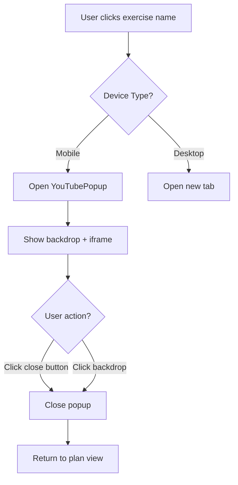

# Design Document: Mobile YouTube Popup

## Overview

Thiết kế một component popup để hiển thị YouTube trên mobile devices, thay thế logic deep linking hiện tại. Component sẽ sử dụng iframe để embed m.youtube.com và cung cấp UI đóng popup dễ dàng.

## Architecture

### Component Structure

```
PlanDisplay (existing)
  └── YouTubePopup (new component)
       ├── Backdrop (overlay)
       ├── Popup Container
       │    ├── Close Button
       │    └── YouTube iframe
       └── State Management
```

### Flow Diagram



## Components and Interfaces

### 1. YouTubePopup Component

**File:** `components/YouTubePopup.tsx`

**Props Interface:**
```typescript
interface YouTubePopupProps {
  isOpen: boolean;
  onClose: () => void;
  searchQuery: string;
}
```

**Responsibilities:**
- Render popup overlay khi `isOpen = true`
- Hiển thị iframe với m.youtube.com search results
- Xử lý đóng popup (close button + backdrop click)
- Responsive design cho mobile
- Animation mở/đóng mượt mà

**Key Features:**
- Full-screen trên mobile
- Fixed positioning với z-index cao
- Backdrop với opacity transition
- Close button luôn visible ở góc trên phải
- Prevent body scroll khi popup mở

### 2. Modified PlanDisplay Component

**Changes to:** `components/PlanDisplay.tsx`

**New State:**
```typescript
const [youtubePopup, setYoutubePopup] = useState({
  isOpen: false,
  searchQuery: ''
});
```

**Modified Function:**
```typescript
const handleOpenYouTube = (exerciseName: string) => {
  const query = encodeURIComponent(`${exerciseName} exercise tutorial form`);
  
  const userAgent = navigator.userAgent || navigator.vendor || (window as any).opera;
  const isMobile = /android|ipad|iphone|ipod/i.test(userAgent);

  if (isMobile) {
    // Open popup instead of deep linking
    setYoutubePopup({
      isOpen: true,
      searchQuery: query
    });
  } else {
    // Desktop: keep existing behavior
    window.open(`https://www.youtube.com/results?search_query=${query}`, '_blank');
  }
};
```

## Data Models

### YouTubePopup State

```typescript
interface YouTubePopupState {
  isOpen: boolean;      // Popup visibility
  searchQuery: string;  // Encoded search query for YouTube
}
```

## UI/UX Design

### Mobile Layout

```
┌─────────────────────────────┐
│ [Backdrop - dark overlay]   │
│                              │
│  ┌──────────────────────┐   │
│  │ [X] Close Button     │   │
│  │                      │   │
│  │                      │   │
│  │   YouTube iframe     │   │
│  │   (m.youtube.com)    │   │
│  │                      │   │
│  │                      │   │
│  └──────────────────────┘   │
│                              │
└─────────────────────────────┘
```

### Styling Approach

- **Backdrop:** `bg-black/90` với `backdrop-blur-sm`
- **Container:** Full screen với padding an toàn
- **Close Button:** 
  - Position: `absolute top-4 right-4`
  - Style: Glass morphism effect matching app theme
  - Icon: X hoặc Close với size 24px
  - Touch target: minimum 44x44px
- **iframe:** 
  - Width: 100% (với max-width cho tablet)
  - Height: 100% (trừ space cho close button)
  - Border radius: `rounded-2xl`
  - Border: `border border-white/10`

### Animation

```css
/* Enter animation */
.popup-enter {
  opacity: 0;
  transform: scale(0.95);
}

.popup-enter-active {
  opacity: 1;
  transform: scale(1);
  transition: all 300ms ease-out;
}

/* Exit animation */
.popup-exit {
  opacity: 1;
  transform: scale(1);
}

.popup-exit-active {
  opacity: 0;
  transform: scale(0.95);
  transition: all 200ms ease-in;
}
```

## Error Handling

### Iframe Loading Issues

**Problem:** YouTube iframe không load được (network issues, blocked)

**Solution:**
- Hiển thị loading spinner trong iframe
- Timeout sau 10s → hiển thị error message
- Cung cấp fallback button "Mở trong trình duyệt"

### Device Detection Edge Cases

**Problem:** User agent detection không chính xác

**Solution:**
- Sử dụng multiple checks: `userAgent`, `navigator.maxTouchPoints`, `window.innerWidth`
- Fallback: Nếu không chắc chắn → sử dụng popup (safer choice)

### Popup Blocking

**Problem:** Browser có thể block popup/iframe

**Solution:**
- Không áp dụng vì ta dùng inline component, không phải `window.open()`
- iframe có thể bị block bởi CSP → cần verify trong testing

## Testing Strategy

### Unit Tests

**File:** `components/YouTubePopup.test.tsx`

1. **Render Tests:**
   - Component renders khi `isOpen = true`
   - Component không render khi `isOpen = false`
   - Close button hiển thị đúng

2. **Interaction Tests:**
   - Click close button → gọi `onClose()`
   - Click backdrop → gọi `onClose()`
   - Click iframe content → không gọi `onClose()`

3. **Props Tests:**
   - `searchQuery` được encode đúng trong iframe src
   - iframe src sử dụng m.youtube.com

### Integration Tests

**File:** `components/PlanDisplay.test.tsx`

1. **Device Detection:**
   - Mock mobile user agent → popup mở
   - Mock desktop user agent → tab mới mở
   
2. **State Management:**
   - Click exercise name → state update đúng
   - Close popup → state reset

### Manual Testing Checklist

- [ ] Test trên iPhone Safari
- [ ] Test trên Android Chrome
- [ ] Test trên iPad
- [ ] Test trên Desktop Chrome/Firefox/Safari
- [ ] Verify animation mượt mà
- [ ] Verify không bị scroll body khi popup mở
- [ ] Verify close button dễ bấm (touch target đủ lớn)
- [ ] Verify iframe load YouTube search results đúng
- [ ] Test với network chậm

## Implementation Notes

### Dependencies

Không cần thêm dependencies mới. Sử dụng:
- React hooks (useState, useEffect)
- Tailwind CSS (đã có sẵn)
- Lucide icons (đã có sẵn)

### Browser Compatibility

- **Target:** Modern mobile browsers (iOS Safari 14+, Chrome 90+)
- **iframe sandbox:** Sử dụng `sandbox="allow-same-origin allow-scripts allow-popups allow-forms"`
- **CSP Considerations:** Cần allow `frame-src https://m.youtube.com`

### Performance Considerations

- Lazy load iframe (chỉ render khi popup mở)
- Cleanup iframe khi đóng popup để free memory
- Debounce close animation để tránh multiple triggers

## Migration Plan

### Phase 1: Create Component
1. Tạo `YouTubePopup.tsx` component
2. Implement basic UI và logic

### Phase 2: Integrate
1. Import component vào `PlanDisplay.tsx`
2. Modify `handleOpenYouTube` function
3. Add state management

### Phase 3: Remove Old Code
1. Xóa deep linking logic (iOS/Android app URL schemes)
2. Xóa fallback timeout logic
3. Clean up comments

### Rollback Plan

Nếu có issues:
1. Revert `handleOpenYouTube` về version cũ
2. Hide `YouTubePopup` component (không xóa)
3. Monitor user feedback
